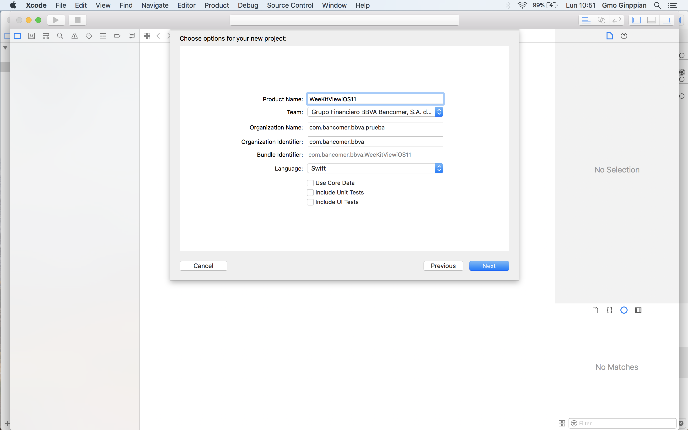
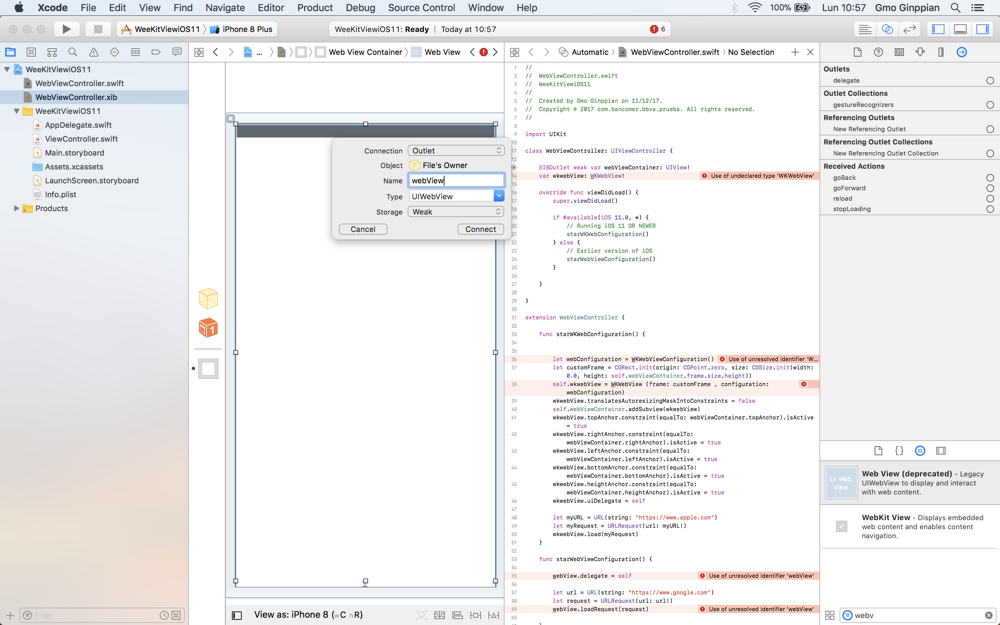

WebKit View - The Right Implementation
============

## About

<p align="justify">
	This imlpementatation support from iOS 11 or less.
</p>

<p align="center">
	
</p>

<p align="center">
	
</p>

<p align="center">
	
</p>

<p align="center">
	
</p>

<p align="center">
	
</p>

<p align="center">
	
</p>

<p align="center">
	
</p>

<p align="center">
	
</p>

<p align="center">
	
</p>

<p align="center">
	
</p>

<p align="center">
	
</p>

<p align="center">
	
</p>

<p align="center">
	
</p>

<p align="center">
	
</p>

<p align="center">
	
</p>

<p align="center">
	
</p>

<p align="center">
	
</p>

<p align="center">
	
</p>

<p align="center">
	
</p>

<p align="center">
	
</p>

<p align="center">
	
</p>

<p align="center">
	
</p>

<p align="center">
	
</p>

<p align="center">
	
</p>

<p align="center">
	
</p>

<p align="center">
	
</p>

<p align="center">
	
</p>

## AppDelegate

```swift
//
//  AppDelegate.swift
//  WeeKitViewiOS11
//
//  Created by Gmo Ginppian on 11/12/17.
//  Copyright © 2017 com.bancomer.bbva.prueba. All rights reserved.
//

import UIKit

@UIApplicationMain
class AppDelegate: UIResponder, UIApplicationDelegate {

    var window: UIWindow?
    var activityIndicator: UIActivityIndicatorView = UIActivityIndicatorView()

    func application(_ application: UIApplication, didFinishLaunchingWithOptions launchOptions: [UIApplicationLaunchOptionsKey: Any]?) -> Bool {
        // Override point for customization after application launch.
        return true
    }

    func applicationWillResignActive(_ application: UIApplication) {
        // Sent when the application is about to move from active to inactive state. This can occur for certain types of temporary interruptions (such as an incoming phone call or SMS message) or when the user quits the application and it begins the transition to the background state.
        // Use this method to pause ongoing tasks, disable timers, and invalidate graphics rendering callbacks. Games should use this method to pause the game.
    }

    func applicationDidEnterBackground(_ application: UIApplication) {
        // Use this method to release shared resources, save user data, invalidate timers, and store enough application state information to restore your application to its current state in case it is terminated later.
        // If your application supports background execution, this method is called instead of applicationWillTerminate: when the user quits.
    }

    func applicationWillEnterForeground(_ application: UIApplication) {
        // Called as part of the transition from the background to the active state; here you can undo many of the changes made on entering the background.
    }

    func applicationDidBecomeActive(_ application: UIApplication) {
        // Restart any tasks that were paused (or not yet started) while the application was inactive. If the application was previously in the background, optionally refresh the user interface.
    }

    func applicationWillTerminate(_ application: UIApplication) {
        // Called when the application is about to terminate. Save data if appropriate. See also applicationDidEnterBackground:.
    }


}
```

## WebViewController

```swift
//
//  WebViewController.swift
//  WebView1
//
//  Created by Gmo Ginppian on 08/12/17.
//  Copyright © 2017 com.bancomer.bbva.prueba. All rights reserved.
//

import UIKit
import WebKit

class WebViewController: UIViewController {
    
    @IBOutlet weak var webViewContainer: UIView!
    var wkwebView: WKWebView!
    
    @IBOutlet weak var webView: UIWebView!
    
    let spinner = UIActivityIndicatorView(activityIndicatorStyle: .whiteLarge)
    
    override func viewDidLoad() {
        super.viewDidLoad()
        
        if #available(iOS 11.0, *) {
            // Running iOS 11 OR NEWER
            starWKWebConfiguration()
        } else {
            // Earlier version of iOS
            starWebViewConfiguration()
        }
        
        
    }
    
}

extension WebViewController {
    
    func starWKWebConfiguration() {
        
        let webConfiguration = WKWebViewConfiguration()
        let customFrame = CGRect.init(origin: CGPoint.zero, size: CGSize.init(width: 0.0, height: self.webViewContainer.frame.size.height))
        self.wkwebView = WKWebView (frame: customFrame , configuration: webConfiguration)
        self.wkwebView.navigationDelegate = self
        
        wkwebView.translatesAutoresizingMaskIntoConstraints = false
        self.webViewContainer.addSubview(wkwebView)
        wkwebView.topAnchor.constraint(equalTo: webViewContainer.topAnchor).isActive = true
        wkwebView.rightAnchor.constraint(equalTo: webViewContainer.rightAnchor).isActive = true
        wkwebView.leftAnchor.constraint(equalTo: webViewContainer.leftAnchor).isActive = true
        wkwebView.bottomAnchor.constraint(equalTo: webViewContainer.bottomAnchor).isActive = true
        wkwebView.heightAnchor.constraint(equalTo: webViewContainer.heightAnchor).isActive = true
        wkwebView.uiDelegate = self
        
        let myURL = URL(string: "https://www.apple.com")
        let myRequest = URLRequest(url: myURL!)
        wkwebView.load(myRequest)
    }
    
    func starWebViewConfiguration() {
        
        webView.delegate = self
        
        let url = URL(string: "https://www.google.com")
        let request = URLRequest(url: url!)
        webView.loadRequest(request)
        
    }
    
}

extension WebViewController: WKUIDelegate {
    
}

extension WebViewController: WKNavigationDelegate {
    
    public func webView(_ webView: WKWebView, didStartProvisionalNavigation navigation: WKNavigation!) {
        
        print("🙊")
        let appDelegate: AppDelegate = (UIApplication.shared.delegate as! AppDelegate)
        
        
        appDelegate.activityIndicator = UIActivityIndicatorView.init(activityIndicatorStyle: UIActivityIndicatorViewStyle.gray)
        appDelegate.activityIndicator.alpha = 1.0
        appDelegate.activityIndicator.center = CGPoint(x: UIScreen.main.bounds.width / 2, y: UIScreen.main.bounds.height / 2)
        
        wkwebView.addSubview(appDelegate.activityIndicator)
        
        appDelegate.activityIndicator.startAnimating()
    }
    
    public func webView(_ webView: WKWebView, didFinish navigation: WKNavigation!) {
        print("😜")
        let appDelegate: AppDelegate = (UIApplication.shared.delegate as! AppDelegate)
        appDelegate.activityIndicator.stopAnimating()
    }
    
}

extension WebViewController: UIWebViewDelegate {
    
    public func webViewDidStartLoad(_ webView: UIWebView) {
        
        print("🙊")
        let appDelegate: AppDelegate = (UIApplication.shared.delegate as! AppDelegate)
        
        
        appDelegate.activityIndicator = UIActivityIndicatorView.init(activityIndicatorStyle: UIActivityIndicatorViewStyle.gray)
        appDelegate.activityIndicator.alpha = 1.0
        appDelegate.activityIndicator.center = CGPoint(x: UIScreen.main.bounds.width / 2, y: UIScreen.main.bounds.height / 2)
        
        webView.addSubview(appDelegate.activityIndicator)
        
        appDelegate.activityIndicator.startAnimating()
    }
    
    public func webViewDidFinishLoad(_ webView: UIWebView){
        
        print("😜")
        let appDelegate: AppDelegate = (UIApplication.shared.delegate as! AppDelegate)
        appDelegate.activityIndicator.stopAnimating()
    }
}
```
